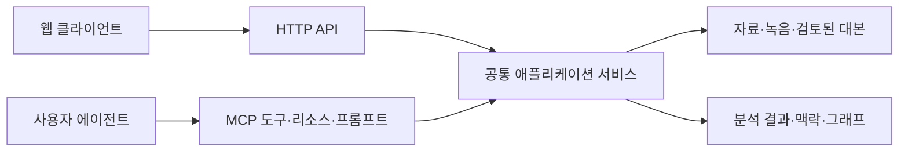

# 맥락이 (Maeglagi)

> 흩어진 업무의 맥락을 잇다.

회의와 문서처럼 흩어진 업무 정보를 AI가 연결해 사람·프로젝트·결정·업무·이벤트의 관계와 현재 맥락을 자동으로 만드는 Organizational Context Platform입니다. 이 저장소는 그 PoC 모노레포입니다.

제품 정의와 슬로건, 브랜드 자산, 디자인 토큰의 기준은 [docs/brand.md](docs/brand.md), 화면 문구와 AI 답변의 말투 기준은 [docs/voice.md](docs/voice.md)에 있습니다.

버그 제보와 개선 제안, 코드·문서 기여를 환영합니다. [GitHub 이슈](https://github.com/tomorrow9913/maeglagi/issues)와 [기여 안내](CONTRIBUTING.md)를 확인해 주세요.

## 구조

```text
.
├── frontend/          # Next.js App Router 웹 클라이언트
├── backend/           # FastAPI API + 맥락 처리 파이프라인
├── contracts/         # Ontology·AI structured output 등 도메인 계약
├── infrastructure/    # 로컬 저장소와 서비스 구성
└── docs/              # 아키텍처 결정 및 개발 문서
```

백엔드는 모듈 경계를 분명히 한 모듈러 모놀리스이며, API와 Celery worker를 별도 프로세스로 배포합니다.

### 내 에이전트로 사용하기

AI 제공업체 API 키 없이도 계정을 만들고 [MCP 연결](docs/mcp.md)을 등록해 사용할 수 있습니다. 사용자 에이전트가 전사·분석·질문 답변을 수행하고, 맥락이는 녹음과 자료, 검토된 회의록, 분석 결과와 온톨로지를 보관합니다. 계정 화면 `/account/mcp`에서 만료·해제가 가능한 전용 연결 토큰을 발급합니다. 음성 처리는 사용하는 에이전트가 지원해야 합니다.



HTTP와 MCP는 인증된 요청을 공통 서비스에 전달하는 진입 계층입니다. MCP 도구에 별도 DB·그래프 저장 규칙을 구현하지 않으며, 원문 근거·소유권·버전·중복 제출 검증은 서비스에서 적용합니다.

## 빠른 시작

필수 도구: Python 3.12+, `uv`, Node.js 22+, `pnpm`, Supabase 프로젝트, Valkey 또는 Redis

```bash
cp .env.example .env

cd backend
uv sync --all-groups
uv run alembic upgrade head
uv run uvicorn app.main:app --reload

cd ../frontend
pnpm install
pnpm dev
```

문서·회의 처리 작업을 실행하려면 Valkey/Redis를 시작하고 `.env`의
`CELERY_BROKER_URL`을 설정한 뒤 별도 터미널에서 worker를 실행합니다.

```bash
cd backend
uv run celery -A app.core.celery:celery_app worker --loglevel=INFO --concurrency=2
```

- Frontend: http://localhost:3000
- API: http://localhost:8000
- Swagger UI: http://localhost:8000/docs
- OpenAPI JSON: http://localhost:8000/openapi.json
- Health: http://localhost:8000/api/v1/health

Supabase가 인증, PostgreSQL, 비공개 Object Storage를 담당합니다. 프론트엔드는
Supabase Auth 세션을 쿠키로 유지하고, FastAPI는 전달받은 access token을
`/auth/v1/user`로 검증합니다. 업로드는 같은 사용자 토큰으로 Storage에 전달되어
`storage.objects`의 RLS 정책을 그대로 적용받습니다. 비동기 worker만 업로드된 원본을
다시 읽기 위해 `SUPABASE_SERVICE_ROLE_KEY`를 사용하며, 이 값은 API·워커 서버 환경에만
두고 프론트엔드에는 절대 노출하지 않습니다.

## 배포

Docker로 API·프론트·워커를 함께 실행하거나 Redis·워커만 선택해 Render/Vercel과
연결하려면 [Docker Compose 배포 가이드](docs/docker-deployment.md)를 사용하세요.
Supabase Auth·PostgreSQL·Storage·Vault는 기존 Supabase 프로젝트에 연결합니다.

백엔드는 저장소 루트의 `render.yaml`을 Render Blueprint로 가져온 뒤 다음 값을 설정합니다.

- API/worker: `DATABASE_URL`, `SUPABASE_URL`, `SUPABASE_PUBLISHABLE_KEY`,
  `SUPABASE_SERVICE_ROLE_KEY`; API: `CORS_ORIGINS`

Blueprint가 API와 worker의 `CELERY_BROKER_URL`을 Render Key Value에 연결하고,
`APP_SECRET_KEY`를 생성해 두 서비스에 설정합니다.

프론트엔드는 `frontend`를 Root Directory로 지정해 Vercel에 배포하고
`NEXT_PUBLIC_API_URL`, `NEXT_PUBLIC_USE_MOCKS`, `NEXT_PUBLIC_SUPABASE_URL`,
`NEXT_PUBLIC_SUPABASE_PUBLISHABLE_KEY`를 설정합니다.

`DATABASE_URL`은 Supabase Dashboard의 session pooler 연결 문자열을
`postgresql+asyncpg://` 스킴으로 바꿔 사용합니다. Supabase Auth의 Site URL에는
Vercel 웹 주소를, Redirect URLs에는 `<웹 주소>/auth/callback`을 등록합니다.

문서와 회의 처리는 Celery worker가 담당합니다. `render.yaml`은 Valkey 8 기반 Render
Key Value(`noeviction`, persistence), API, background worker를 함께 만들고 두 서비스에
내부 `CELERY_BROKER_URL`을 연결합니다. 문서 파싱은 Microsoft의 MIT 오픈소스
MarkItDown을 사용해 PDF/DOCX/TXT/MD를 Markdown으로 정규화합니다.

DB 스키마의 단일 기준은 SQLModel `SQLModel.metadata`와 `backend/migrations`의
Alembic revision입니다. 배포 전 `make migrate`를 실행하고, 모델 변경 후에는
`make migration name=변경_설명`으로 revision을 생성합니다. Supabase SQL Editor에서
별도 migration 파일을 실행하지 않습니다.
Render 무료 웹 서비스는 `render.yaml`의 시작 명령에서 `alembic upgrade head`를 먼저
실행합니다. Docker Compose는 `migrate` 서비스를 실행한 뒤 API를 시작합니다.

## BYOK provider credential

워크스페이스는 OpenAI·Anthropic·NVIDIA NIM 등 provider별 키를 여러 개 보관할 수 있습니다.
각 credential은 `(workspace, provider, label)`로 구분하고 하나를 기본 키로 지정합니다.
API 키와 Ollama 연결은 계정에 저장하고, 역할별 모델 선택은 워크스페이스에 저장합니다.
새 워크스페이스는 저장된 연결 ID를 선택하므로 키를 다시 입력하지 않아도 됩니다.

- `GET|POST /api/v1/provider-credentials` — 계정 연결 목록·등록
- `PUT|DELETE /api/v1/provider-credentials/{id}` — 계정 연결 수정·삭제
- `POST /api/v1/llm-keys/validate` — 키 형식 검사 후 provider 연결 검증
- `POST /api/v1/llm-keys/models` — 새 키 또는 저장된 `credentialId`의 모델 목록
- `GET /api/v1/workspaces/{id}/provider-credentials` — 계정 연결 목록을 반환하는 호환 API
- `GET|PUT /api/v1/workspaces/{id}/llm-key` — 기존 프론트용 기본 키 호환 API
- `GET /api/v1/workspaces/{id}/ai/providers` — 구현된 provider, capability, 사용 가능한 모델 목록
- `POST /api/v1/workspaces/{id}/ai/chat` — 공통 요청을 provider adapter로 위임

새 키 원문은 Supabase Vault에 저장하고 `provider_credentials`에는 Vault secret UUID만
기록합니다. 키 원문은 API 응답이나 로그로 반환하지 않습니다. `APP_SECRET_KEY`는
Vault 도입 전에 암호화해 저장한 credential을 읽는 호환 경로에서 사용합니다.
provider 호출은 공통 adapter 계약으로 정규화하되 provider 고유 옵션과 응답 메타데이터는
확장 필드에 보존합니다. 새 provider는 registry에 adapter를 등록해야만 API 목록에 노출됩니다.

기존 credential ID와 Vault secret은 계정 전환 시 유지합니다. 워크스페이스를 삭제해도
계정 연결은 보존하며, 다른 워크스페이스가 사용하는 연결은 바로 삭제할 수 없습니다.

### Self-hosted Ollama

Ollama는 환경변수와 관계없이 provider 목록에 표시됩니다. 계정의 API 연결
설정에서 서버 주소와 선택적 인증 키를 등록합니다. 주소는 계정별 DB에,
키는 Supabase Vault에 암호화 저장하며 API 응답에는 키 원문을 반환하지 않습니다.
등록한 연결은 같은 계정의 워크스페이스에서 재사용하고, 모델 선택은 워크스페이스별로
저장합니다. 여러 Ollama 서버를 등록하면 모델 선택 시 연결 ID까지 보존해 선택한 서버로 요청합니다.

SaaS(`DEPLOYMENT_MODE=saas`, 서버 기본값)는 사용자가 운영하는 공개 HTTPS 서버에
연결합니다. 온프레미스 Compose는 `self_hosted`를 기본으로 사용하여 내부망과 Docker
서버를 등록할 수 있습니다. 같은 Compose의 Ollama는 `http://ollama:11434`, 호스트에서
실행 중인 Ollama는 `http://host.docker.internal:11434`를 입력합니다. 주소는 브라우저가
아닌 **API와 분석 worker에서 접근 가능한 주소**여야 합니다. SaaS에 사용자의 PC
`localhost`를 입력해 연결할 수는 없으며, 외부 접속용 HTTPS 주소가 필요합니다.

서버가 주소 정책을 적용하고 DNS 확인 결과로 실제 연결 대상을 고정합니다. 리다이렉트,
URL 내 인증정보, 클라우드 메타데이터·링크 로컬 주소는 허용하지 않습니다. SaaS의
사설망 예외는 운영자의 `OLLAMA_ALLOWED_PRIVATE_HOSTS` 설정으로만 부여합니다.
`OLLAMA_BASE_URL`은 저장 주소가 없는 기존 연결의 호환용 기본값입니다.

로컬 전용 배포에서는 Ollama 서비스에 `OLLAMA_NO_CLOUD=1`을 설정하고 재시작하세요.
Ollama의 로컬 서버도 로그인하면 cloud 모델을 프록시할 수 있어, 애플리케이션은
`:cloud` 모델을 목록과 호출에서 거절합니다. 설치된 모델 중 `/api/show`가 대화 기능을
보고한 모델을 답변과 추출에 표시합니다. 임베딩은 `/api/embed`에 1536차원을 요청한
작은 probe가 정확히 1536개 값을 반환한 모델만 표시합니다. 모든 Ollama 임베딩 모델이
이 저장소의 `Vector(1536)` 스키마와 호환되는 것은 아닙니다. 차원이 다르면 색인과
검색은 오류를 반환하며 벡터를 채우거나 다른 provider로 전환하지 않습니다. 기존
워크스페이스에서 선택된 임베딩 모델은 계속 고정됩니다.

Ollama 연결은 LLM 호출만 로컬로 옮깁니다. 인증, PostgreSQL, 원본 파일 Storage는
여전히 Supabase를 사용하며 녹음 음성 인식에는 별도 provider가 필요합니다.
Ollama API 규약: [소개](https://docs.ollama.com/api/introduction),
[chat](https://docs.ollama.com/api/chat), [embed](https://docs.ollama.com/api/embed),
[tags](https://docs.ollama.com/api/tags),
[cloud 비활성화](https://docs.ollama.com/faq#how-can-i-disable-ollama-cloud-features).

## 설계 원칙

NIM 비스트리밍 요청의 읽기 제한은 `NVIDIA_CHAT_READ_TIMEOUT_SECONDS`로 조절합니다
(기본 180초, 허용 범위 60–600초). `z-ai/glm-5.3-flash`의 추출 단계는
`NVIDIA_GLM_EXTRACTION_REASONING_EFFORT=low`를 기본으로 사용하며 `high`, `max`도
설정할 수 있습니다. 다른 모델과 Ask의 추론 설정에는 적용하지 않습니다.
[NVIDIA 모델 문서](https://docs.api.nvidia.com/nim/re/reference/z-ai-glm-5-3-flash)에 따르면
이 모델의 공급자 기본 추론 강도는 `max`입니다.

실패한 서버 음성 인식은 저장된 녹음으로 브라우저 받아쓰기를 다시 시도할 수 있습니다.
오디오 트랙 입력을 지원하는 데스크톱 Chrome/Edge 135 이상에서 제공하며,
브라우저의 음성 인식 서비스에 녹음이 전송될 수 있습니다. 결과는 같은 소스의 초안으로
저장하고 사용자가 편집·확정한 뒤 분석합니다. 실제 음성 서비스와 긴 녹음의 재생 URL
만료 동작은 [후속 검증 항목](https://github.com/tomorrow9913/maeglagi/issues/80)입니다.

- 원문, 관계형 메타데이터, 임베딩, 그래프를 각각 Object Storage, PostgreSQL, Vector Store, Graph DB에 저장합니다.
- LLM 호출은 `context_engine` 모듈의 provider port 뒤로 격리합니다.
- 라우터는 입력 검증과 HTTP 변환만 맡고 비즈니스 흐름은 application service가 담당합니다.
- API 계약의 단일 기준은 FastAPI 라우터와 Pydantic 모델이며 OpenAPI 문서는 자동 생성합니다.
- 프론트는 `frontend/src/lib/api/`의 타입과 클라이언트를 사용하고, mock/real API를 환경변수로 전환합니다.
- Provider API key는 Supabase Vault에 보관하고 원문을 API 응답으로 다시 노출하지 않습니다.

상세 내용은 [docs/architecture.md](docs/architecture.md)를 참고하세요.

## OpenAPI 계약

OpenAPI 파일을 수동으로 중복 관리하지 않습니다. FastAPI가 라우터와 Pydantic 모델을 바탕으로 생성하는 `/openapi.json`을 API 계약의 단일 Source of Truth로 사용합니다.

```text
FastAPI router + Pydantic model
                ↓
          /openapi.json (개발 환경)
```

개발 환경에서 백엔드를 실행하면 `/openapi.json`과 `/docs`에서 현재 API를 확인할 수
있습니다. 운영 환경에서는 두 경로가 비활성화됩니다. 현재 프론트 API 타입과 클라이언트는
`frontend/src/lib/api/`에 있으며 자동 생성 스크립트는 없습니다. API 변경 시에는
FastAPI 라우터/Pydantic 모델과 프론트 클라이언트를 함께 맞춥니다.
`contracts/openapi.yaml`은 저장소에 남아 있는 수동 명세이며 현행 API의 기준은 아닙니다.
